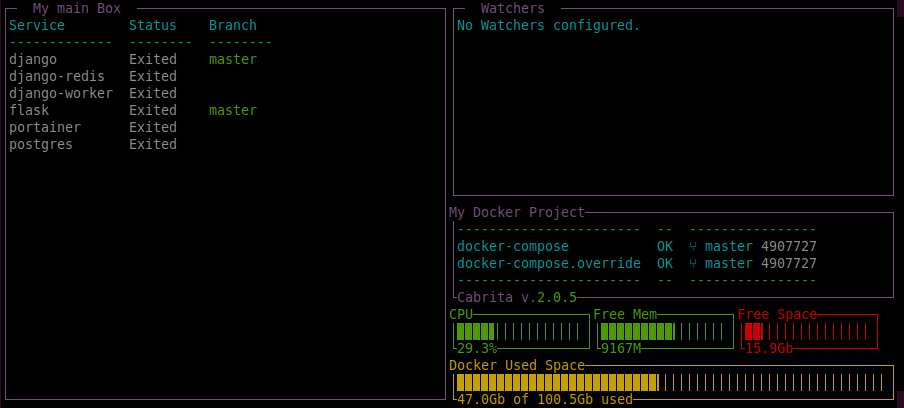

## Welcome to Cabrita's documentation!

Cabrita is a Terminal Dashboard for docker services. You can easily
follow the status for your docker containers:

* Which services are running
* The ports used by each one
* The number of instances
* The git status for the source code inside them
* The container healthcheck status, if available

### Usage

Usage is very simple: just change directory where's `docker-compose.yml`
is located and run:

```bash
$ cd /path/to/docker/compose/file
$ cabrita
```

[](https://asciinema.org/a/Z31bttxgBe4JhuyBPvLYomoqc)

You can also pass the full path for the `docker-compose.yml` files on
command line:

```bash
$ cabrita /path/to/docker/compose/file1 /path/to/docker/compose/file2
```

### Customize

To customize cabrita you will need to create a special file, called
`cabrita.yml` to create or config _boxes_. You can select which docker
containers will show in each box and what info these boxes will show for
each them.

For example, copy and paste this yaml and save the `cabrita.yml` in the
same directory where your `docker-compose.yml` is located:

```yaml
version: 2
title: My Docker Project
compose_files:
  - ./docker-compose.yml
  - ./docker-compose.override.yml
boxes:
  main_box:
    main: true
    name: My Services
    port_detail: both
```

This file will create a dashboard called *My Docker Project*, which will
read all services from both `docker-compose.yml` files and add them to
the box called *My Services*.

This is the main box (`main: true`), which means all docker services
which are not included in any other box, will be added here. The only
configuration on this box for now, is the `port_detail` option which
will show on dashboard both internal and external ports for running
services.

To use this file, use the `--path` option for cabrita command line. You
can also define the `CABRITA_PATH` environment variable for this path.

In your example:

```bash
# cd to /examples
$ TEST_PROJECT_PATH=$pwd docker-compose up -d
$ cabrita --path cabrita.yml
```



