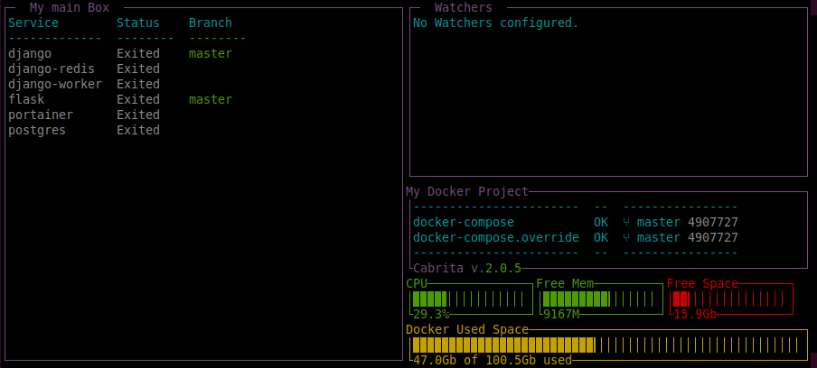

Cabrita Tutorial
----------------

.. toctree::
   :maxdepth: 2
   :caption: Modules:

Tutorial
========

To customize cabrita you can create a special file, called ``cabrita.yml``
to create or config _boxes_. You can select which docker containers will
show in each box and what info these boxes will show for each service
inside them.

For example, copy and paste this yaml and save the ``cabrita.yml`` in the
same directory where your `docker-compose.yml` is located:

.. code-block:: yaml

    version: 2
    title: My Docker Project
    background_color: grey # options: black, blue, cyan, grey, yellow, white
    compose_files:
      - ./docker-compose.yml
    boxes:
      main_box:
        main: true
        name: My Services

This file will create a dashboard called *My Docker Project*, which will
read all services from the ``docker-compose.yml`` file and add them to the
box called *My Services*.

This is the main box (``main: true``), which means all docker services
which are not included in any other box, will be added here.

To use this file, use the ``--path`` option for cabrita command line. You
can also define the ``CABRITA_PATH`` environment variable for this path.

Using the our docker-compose in ``/examples`` folder:

.. code-block:: bash

    # You can call directy the app passing the yaml path
    $ cd path/to/examples
    $ TEST_PROJECT_PATH=$(pwd) docker-compose up -d
    $ cabrita --path cabrita.yml

    # Or you can use the CABRITA_PATH environment variable
    $ export CABRITA_PATH=/path/to/yml
    $ cabrita

The new dashboard will show:

Customize Ports
***************

You can define, for each box, if the docker ports will be show in
dashboard. Let's add two new options: ``port_view`` and ``port_detail`` on
``cabrita.yml``:

.. code-block:: yaml
    version: 2
    title: My Docker Project
    background_color: grey # options: black, blue, cyan, grey, yellow, white
    compose_files:
      - ./docker-compose.yml
    boxes:
      main_box:
        main: true
        name: My Services
        port_view: status # options: column, name, status
        port_detail: internal # options: internal, external or both

The new dashboard will show:

Customize Git info
******************

For more git information, let's add two new options: ``show_revision`` and
``target_branch``:

.. code-block:: yaml

    version: 2
    title: My Docker Project
    background_color: grey # options: black, blue, cyan, grey, yellow, white
    compose_files:
      - ./docker-compose.yml
    boxes:
      main_box:
        main: true
        name: My Services
        port_view: status # options: column, name, status
        port_detail: internal # options: internal, external or both
        show_revision: true # will show commit hash and git tag if available
        watch_branch: origin/staging # check how ahead or behind you are regard this branch

The "**Branch**" column are displayed in each box, by default (you can
disable it with the ``show_git: false`` option). This column shows the
actual branch name for each service in box. If the branch is dirty (i.e.
has non-committed modifications), text color will be yellow.

The ``show_revision`` option show, for each service in box, the commit
hash and git tag, if available.

The ``watch_branch`` will add on "Branch" column how many commits ahead or
behind the current branch are in comparison of the *watched* branch.

The new dashboard will show:

Adding new boxes
****************

Let's add the ``docker-compose.override.yml`` and create a new box, only
for django applications:

.. code-block:: yaml

    version: 2
    title: My Docker Project
    background_color: grey # options: black, blue, cyan, grey, yellow, white
    compose_files:
      - ./docker-compose.yml
      - ./docker-compose.override.yml
    boxes:
      main_box:
        main: true
        name: My Services
        port_view: status # options: column, name, status
        port_detail: internal # options: internal, external or both
        show_revision: true # will show commit hash and git tag if available
        watch_branch: origin/staging # check how ahead or behind you are regard this branch
      django:
        name: Django Apps
        show_git: false
        includes:
          - django

This file contains a new box, called *django*. The `includes` option is
used to create a list of services which will include on this box. This
option is mutually exclusive with `main` option, because every service
not included in `include` for all boxes will be display in the main box.

The new dashboard will show:

The "Django Apps" box will show 3 services. But we can understand these
docker containers are just one big service in docker. Because they all
got the same name - "django" - we can categorize all services in the
same line, using the ``categories`` option:

.. code-block:: yaml

    version: 2
    title: My Docker Project
    background_color: grey # options: black, blue, cyan, grey, yellow, white
    compose_files:
      - ./docker-compose.yml
      - ./docker-compose.override.yml
    boxes:
      main_box:
        main: true
        name: My Services
        port_view: status # options: column, name, status
        port_detail: internal # options: internal, external or both
        show_revision: true # will show commit hash and git tag if available
        watch_branch: origin/staging # check how ahead or behind you are regard this branch
      django:
        name: Django Apps
        show_git: false
        includes:
          - django
        categories:
          - worker
          - redis

The new dashboard will show:

Adding watchers
***************

Watchers are customized file and ping checkers for your project. Let's
add a new watcher, to check internet connection:

.. code-block:: yaml

    version: 2
    title: My Docker Project
    background_color: grey # options: black, blue, cyan, grey, yellow, white
    compose_files:
      - ./docker-compose.yml
      - ./docker-compose.override.yml
    boxes:
      main_box:
        main: true
        name: My Services
        port_view: status # options: column, name, status
        port_detail: internal # options: internal, external or both
        show_revision: true # will show commit hash and git tag if available
        watch_branch: origin/staging # check how ahead or behind you are regard this branch
      django:
        name: Django Apps
        show_git: false
        includes:
          - django
        categories:
          - worker
          - redis
    watchers:
      ping:
        google:
          name: Check internet connectivity
          address: https://www.google.com
          message_on_success: UP
          message_on_error: DOWN

The new dashboard will show:

